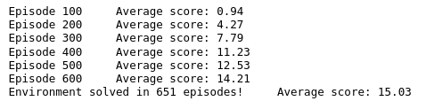
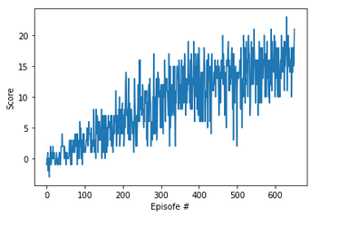

# Navigation 
Training agent to eat yellow bananas and avoiding blue bananas

##### Table of Contents 
- [Project Description](#project-description)
    - [Environment](#environment)
    - [Learning algorithm](#learning-algorithm)
- [Plot of rewards](#plot-of-rewards)
- [Ideas for future Work](#ideas-for-future-work)
- [Bibliographie](#bibliographie)

## Project Description
#### Environment
In this project agent is trained to navigate and collect bananas. The state space has 37 dimensions and contains the agent's velocity, along with ray-based perception of objects around agent's forward direction. The action space has four discrete actions: move forward, move backward, turn right and turn left. The the environment is considered solved when agent obtains an average score of +13 over 100 consecutive episodes.

#### Learning algorithm
The solution implemented is a simple Deep Q-Learning (DQN) algorithm based on the classic Deep Mind paper from Nature. Hassabis et al. Human-level control through deep reinforcement learning. Nature February 2015. It included experience replay and fixed Q targets, both of which are considered standard in a DQN.
 
 The neural network is composed of 3 FC layers with Relu activation after the first and second layer.
 - First layer: input size - 37 and output size - 64
 - Second layer: input size - 64 and output size - 64
 - Third layer: input size - 64 and output size - 4

training hyperparameters are as follow:
- Buffer size: 100000
- Batch size: 64
- gamma: 0.99
- tau: 0.001
- learning rate: 0.005
- update every: 4

## Plot of rewards
The environment has been solved in 403 episodes.  

Here is the graph of the score evolution:  

## Ideas for future Work
To improve the convergence speed, the evolution mentioned in the course may be used. The Double DQN [1] may help reduce the overestimates of the action values. the dueling DQN [2] could be useful for better generalization across action space and prioritized experience replay[3] could speed convergence using more intelligent experince sampling. A Rainbow DQN [4] that mix all the recent amelioration of the orignal DQN could also be used.

## References
1. [Double DQN](https://arxiv.org/abs/1509.06461)
2. [Dueling DQN](https://arxiv.org/abs/1511.06581)
3. [Prioritized experience replay](https://arxiv.org/abs/1511.05952)
4. [Rainbow DQN](https://arxiv.org/abs/1710.02298)
